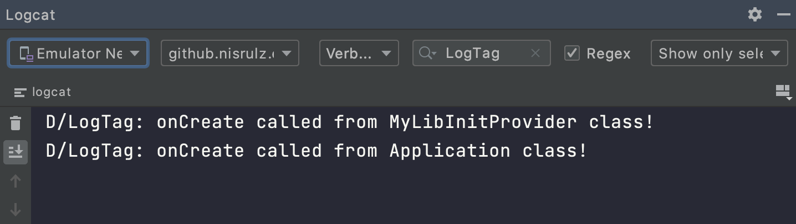

<div align="center">
<h1>Android Library Init Examples 🚀</h1>
<strong>
  <em>Simple basic isolated android examples to showcase various library initialization mechanisms. </em>
</strong></div>

<br>

<div align="center"><a href="https://github.com/nisrulz/android-lib-init-examples">
  
</a> <a href="https://github.com/nisrulz/android-lib-init-examples/fork">
  
</a> <a href="https://github.com/nisrulz/android-lib-init-examples">
  
</a> <a href="https://github.com/nisrulz/android-lib-init-examples">
  
</a><a href="https://twitter.com/nisrulz">
  
</a>

</div>

## Examples
- [Using Normal Class Constructor To Init Lib](/UsingNormalClassConstructorToInitLib) 
- [Using Normal Class Init Function To Init Lib](/UsingNormalClassInitFnToInitLib)
- [Using LifecycleObserver To Init Lib](/UsingLifecycleObserverToInitLib)  
- [Using Singleton To Init Lib](/UsingSingletonToInitLib)
- [Using ContentProvider To Init Lib](/UsingContentProviderToInitLib)
- [Using AndroidX Startup](/UsingAndroidXStartup)

## Questions
- **Question: Is a ContentProvider's `onCreate()` called before the Application's `onCreate()` ?**
  
  Ans: Yes. 
  
  Example app: [Application Class Init Vs ContentProvider Init](/ApplicationClassInitVsContentProviderInit)

  

## Contribution/Pull Requests
I welcome and encourage all pull requests. It usually will take me within 24-48 hours to respond to any issue or request. Here are some basic rules to follow to ensure timely addition of your request:
  1. Match coding style (braces, spacing, etc.) This is best achieved using `Reformat Code` feature of Android Studio `CMD`+`Option`+`L` on Mac and `CTRL` + `ALT` + `L` on Linux + Windows .
  2. If its a feature, bugfix, or anything please only change code to what you specify.
  3. Please keep PR titles easy to read and descriptive of changes, this will make them easier to merge :)
  4. Pull requests _must_ be made against `develop` branch. Any other branch (unless specified by the maintainers) will get rejected.
  5. Check for existing [issues](https://github.com/nisrulz/android-lib-init-examples/issues) first, before filing an issue.
  6. Make sure you follow the set standard as all other projects in this repo do

      + Upgrade your gradle wrapper to the one all other apps are using. Use the below command at root of your project

          ```
          ./gradlew wrapper --gradle-version <version_name>
          ```
          i.e `./gradlew wrapper --gradle-version 6.5`
      
      + Use the package name of the format `github.nisrulz.example.*` where `*` is the example you are adding to the repo. I am trying to follow a set standard in the repo, please adhere to that.
  7. Have fun!

## Talk/Presentation
- [Droidcon Americas 2020](https://crushingcode.nisrulz.com/talks/droidcon_americas_2020/)

License
=======

    Copyright 2020 Nishant Srivastava

    Licensed under the Apache License, Version 2.0 (the "License");
    you may not use this file except in compliance with the License.
    You may obtain a copy of the License at

       http://www.apache.org/licenses/LICENSE-2.0

    Unless required by applicable law or agreed to in writing, software
    distributed under the License is distributed on an "AS IS" BASIS,
    WITHOUT WARRANTIES OR CONDITIONS OF ANY KIND, either express or implied.
    See the License for the specific language governing permissions and
    limitations under the License.

[Read the full text here](/LICENSE)
